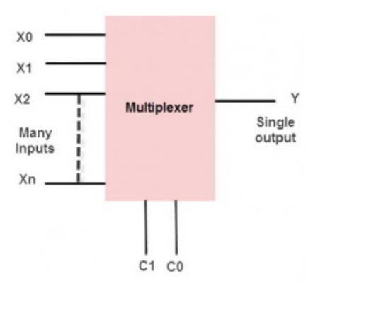
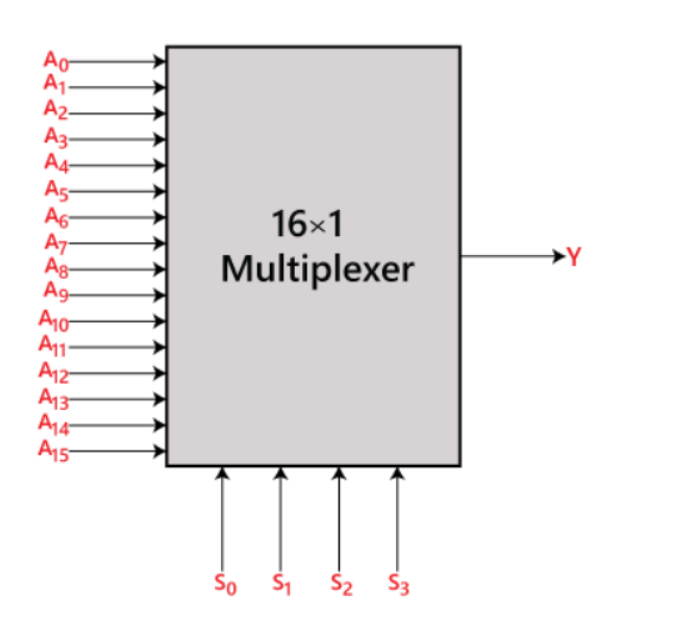
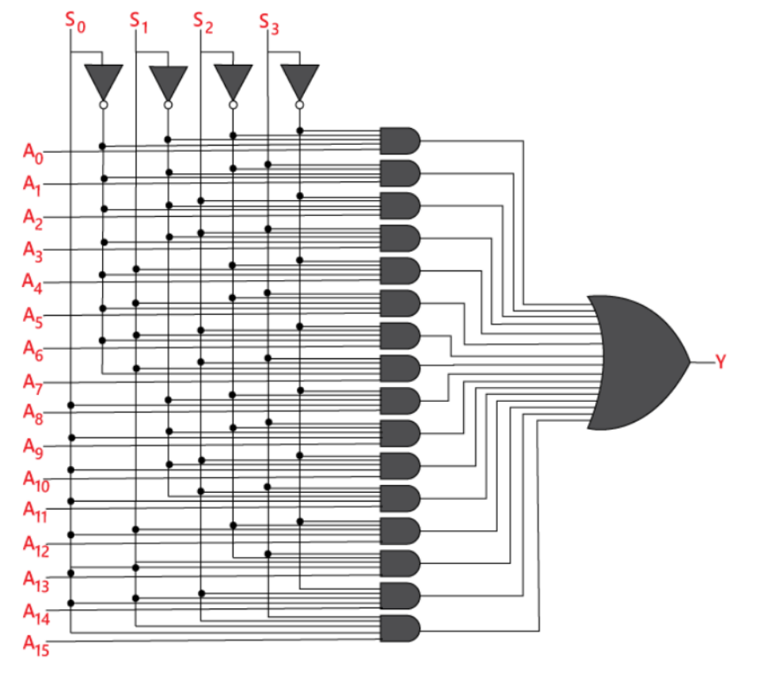
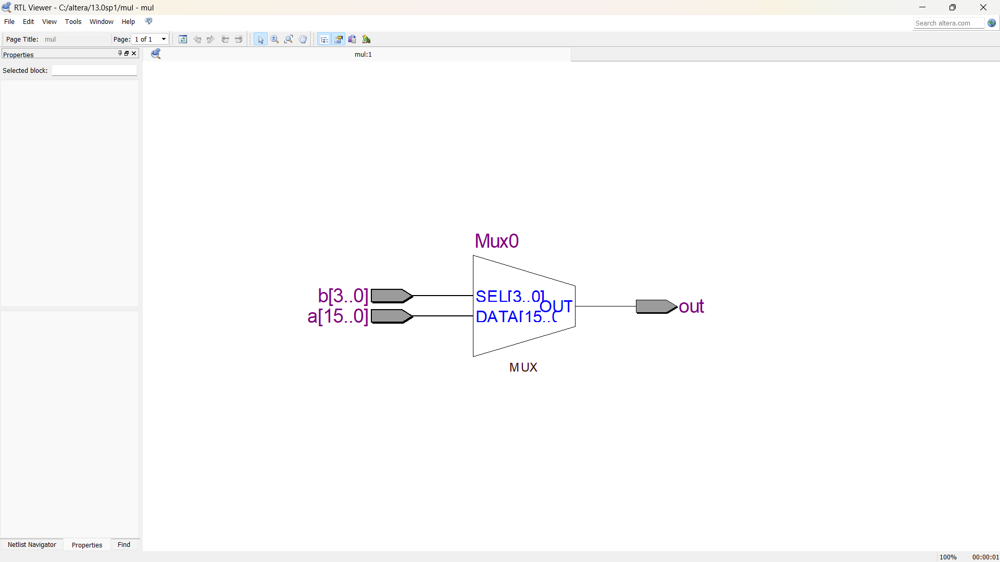
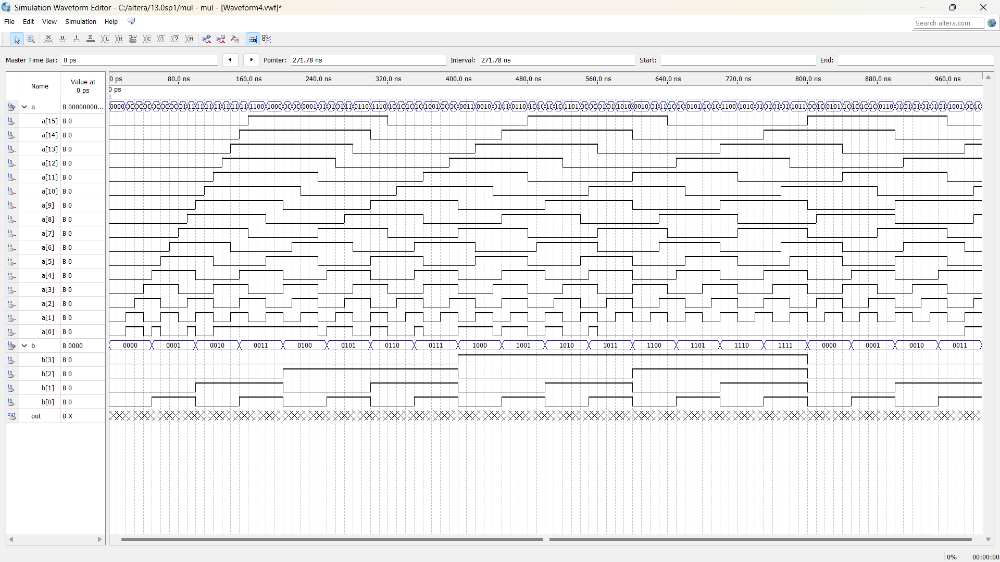
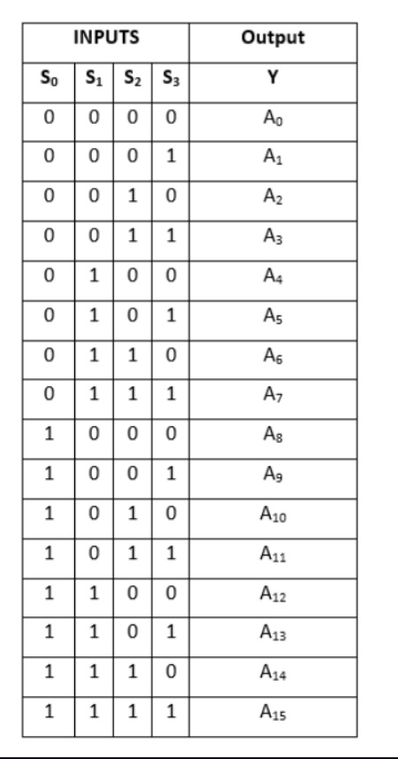

# 16:1 MULTIPLEXER USING VERILOG

## AIM
To implement 16:1 multiplexer using verilog.

## HARDWARES REQUIRED
PC,USB flasher and Cyclone ||.

## SOFTWARE REQUIRED
Quartus prime

## THEORY

### MULTIPLEXER:
The multiplexer is a device that has multiple inputs and single line output. The select lines determine which input is connected to the output, and also increase the amount of data that can be sent over a network within a certain time. It is also called a data selector.

The single-pole multi-position switch is a simple example of a non-electronic circuit of the multiplexer, and it is widely used in many electronic circuits. The multiplexer is used to perform high-speed switching and is constructed by electronic components.A multiplexer, often abbreviated as "MUX," is a digital electronic device that combines multiple input signals into a single output signal. It is commonly used in digital circuitry and communication systems to transmit multiple data streams over a single channel or to select one of several input sources for further processing.

A multiplexer has several input lines, usually denoted as "n" lines, and one or more control lines, typically denoted as "s" lines. The number of control lines determines the number of input lines that can be selected. For example, with a 2-bit control line, you can select one of four input lines (2^2 = 4). The selected input line is then connected to the output line.

### 16:1 MULTIPLEXER
In the 16 to 1 multiplexer, there are total of 16 inputs, i.e., A0, A1, …, A16, 4 selection lines, i.e., S0, S1, S2, and S3 and single output, i.e., Y. On the basis of the combination of inputs that are present at the selection lines S0, S1, and S2, one of these 16 inputs will be connected to the output. The block diagram and the truth table of the 16×1

A 16:1 multiplexer is a digital logic component that has 16 input lines, one output line, and four control or select lines. It is also known as a 16-input multiplexer. The select lines determine which input line is connected to the output line.

The control or select lines are usually binary and represent a unique combination of values from 0 to 15 (in binary form). Each combination of select line values corresponds to one of the 16 input lines. The selected input line is then routed to the output line.

In the truth table above, S3, S2, S1, and S0 represent the four select lines, and I15 to I0 represent the input lines. The selected input line, determined by the select lines' binary combination, is passed to the output line.The 16:1 multiplexer is often used in digital systems to select one out of 16 inputs and route it to the output based on the control signals provided by the select lines.


## ALGORITHM
### STEP 1:
Create a project with the required entities.

### STEP 2:
Create a module with a file name.

### STEP 3:
In the created module, input the code and run the simulation.

### STEP 4:
Once it runned successfully, view the RTL output.

### STEP 5:
Create university program (VWF) to get timing diagram.

### STEP 6:
Give the desired inputs for timing diagram and finally get the result.

## PROGRAM
```c++
/*
Program for flipflops and verify its truth table in quartus using verilog.
Developed by: Shakthi kumar S
Register number: 212222110043
*/module mul(out,a,b);
input[15:0]a;
input[3:0]b;
output reg out;
always@(a,b)
begin
case(b)
4'b0000:out=a[0];
4'b0001:out=a[1];
4'b0010:out=a[2];
4'b0011:out=a[3];
4'b0100:out=a[4];
4'b0101:out=a[5];
4'b0110:out=a[6];
4'b0111:out=a[7];
4'b1000:out=a[8];
4'b1001:out=a[9];
4'b1010:out=a[10];
4'b1011:out=a[11];
4'b1100:out=a[12];
4'b1101:out=a[13];
4'b1110:out=a[14];
4'b1111:out=a[15];
endcase
end
endmodule
```
## LOGIC DIAGRAM

## NETLIST DIAGRAM

## TIMING DIAGRAM

## TRUTH TABLE


## RESULT
Thus 16:1 multiplexer was implemented and verified.
